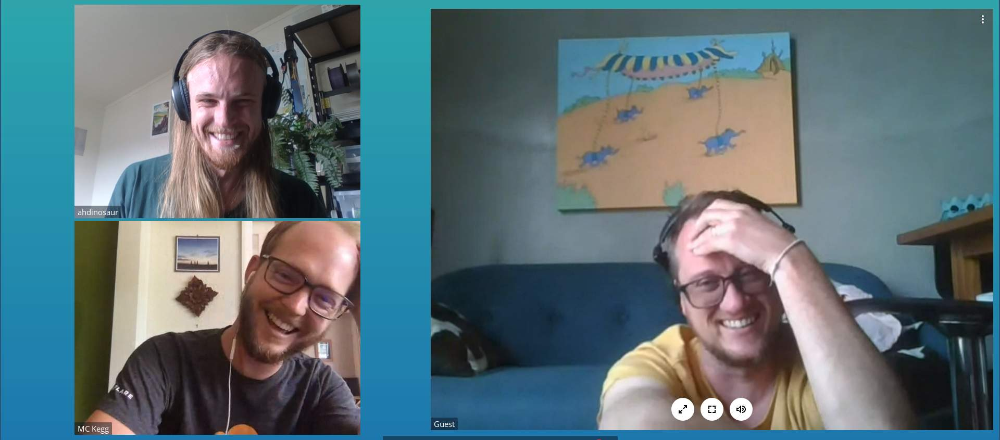

# :sunrise: :notes: Sunrise Choir January Newsletter :sunrise: :notes:

## What is the Sunrise Choir? 

> the Sunrise Choir is a team developing the next generation of solarpunk peer-to-peer communication systems using Scuttlebutt.
>
> we aim to evolve the fundamentals of the Scuttlebutt core protocol: to create both a future-proofed, maintainable, and accessible implementation and a tightly-coordinated, clearly defined, focused, and rhythmic team. 

If you'd like to read more, [here is Mikey's original post announcing the project](https://viewer.scuttlebot.io/%25zv56AbEcR1%2BXKcOF3E7J%2BHNoKrxsd%2B0MQ%2FeVPQanfb8%3D.sha256)

## Who is in the Choir?

- @mikey: [Website](https://dinosaur.is) | [GitHub](https://github.com/ahdinosaur) | `@6ilZq3kN0F+dXFHAPjAwMm87JEb/VdB+LC9eIMW3sa0=.ed25519`
- @piet: [Website](http://pietgeursen.github.io/) | [GitHub](https://github.com/pietgeursen) | `@U5GvOKP/YUza9k53DSXxT0mk3PIrnyAmessvNfZl5E0=.ed25519`
- @matt: [GitHub](https://github.com/mmckegg/) | `@FbGoHeEcePDG3Evemrc+hm+S77cXKf8BRQgkYinJggg=.ed25519`
- (no longer on the team) @aljoscha: [Website](http://www.aljoscha-meyer.de/) | [GitHub](https://github.com/AljoschaMeyer/) | `@zurF8X68ArfRM71dF3mKh36W0xDM8QmOnAS5bYOq8hA=.ed25519`

## Meetings

We meet once a week for a video chat. We've met 16 times since we started out, including for a retrospective and a talk with @mix and @matt about common queries that clients use in patchwork and patchbay. All our meeting notes are [here](https://github.com/sunrise-choir/meta/tree/master/meetings).

A lot has happened since @dinosaur first started the project 5 months ago.

- @aljoscha left the team. But not before he did a bunch of amazing work.
- @matt joined.
- @dinosaur created a [website](https://sunrisechoir.com), [GitHub organisation](https://github.com/sunrise-choir), [Twitter account](https://twitter.com/sunrise_choir), and [Open Collective page](https://opencollective.com/sunrise-choir)
- Work. 
  - @piet has logged 360 hours so far on the project. Pdf of timesheet report [here](/newsletters/images/piet-hours-report.pdf)  
  
  - @aljoscha worked for 2 months.

- work so far, directly quoting dev diaries:
    - open collective
    - request for funding
    - mik's original post to introduce the project, context on why this project was created
    - pie's rusty bindings, private box, napi-sys
    - piet's dreams of a rusty sbot
    - alj's spec work (quote his ending post)
    - pie's rusty flume & sql flumeview
    - teasers of the upcoming work, matt joining
      - reverse conference talks at scuttlecamp.
- images
    - snapshot of mik's original post
    - snapshot of alj's spec website
    - all the messy whiteboard photos
    - pie's sql schema 
